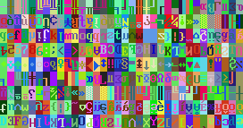

[](http://reddit.com/r/sadconsole)
[](https://gitter.im/Thraka/SadConsole?utm_source=badge&utm_medium=badge&utm_campaign=pr-badge&utm_content=badge)
[]()


| Framework | Core | Controls | GameHelpers | Ansi |
| --- | --- | --- | --- | --- |
| MonoGame DX | [][dx-core] | [][dx-controls] | [][dx-game] | [][dx-ansi] |
| SFML | [][sfml-core] | [][sfml-controls] | [][sfml-game] | [][sfml-ansi] |
| MonoGame GL | [][gl-core] | [][gl-controls] | [][gl-game] | [][gl-ansi] |


SadConsole is an MonoGame 3.5-based game library (using .NET 4.6) that provides an engine to emulate old-school console and command prompt style graphics. One or more textures are used to represent the standard ascii character set. SadConsole allows you to create console instances which can be managed independently of each other. A console is made up of individual cells which can have a foreground, background, character, and a special effect applied to it. 

SadConsole targets Windows and Linux using MonoGame 3.5 or SFML.

There is source code for a screen editor written in SadConsole. It's the most comprehensive project to date using SadConsole and is available at https://github.com/Thraka/SadConsoleEditor/  

>**NOTE**  
>The editor is not yet upgraded to SadConsole 3.0 and cannot be used with it.

Some sample games are provided in the [SampleGames](https://github.com/Thraka/SadConsole/tree/master/SampleGames) folder and are now part of the Visual Studio solution file.

* [Features](#features)
* [Demo video](#demo-video)

## Features

Here are some of the features SadConsole supports.

* Show any number of consoles
* Uses PNG graphic fonts supporting more than 256 characters
* Multiple fonts in your game
* Draggable console windows within the game
* Text GUI controls
* Full keyboard support
* Full mouse support
* Read ansi files from the good old DOS days
* Animation engine
* Instruction engine

#### String display and parsing


#### GUI library


#### Scrolling


#### Demo video
http://youtu.be/ZukjZIqDfJw

## Dependencies
SadConsole uses NuGet for its .NET dependencies, but requires some external dependencies on MacOS and Linux.

### MacOS
As a MonoMac project, Xcode must be installed along with the full Xamarin development kit and you'll want to use the [SadConsole OpenGL](http://www.nuget.org/packages/SadConsole.Core.MonoGameGL/) library instead of the default DirectX library.

### Linux
SadConsole for Linux should work with no problems. If you compile for Mono and use the [SadConsole OpenGL](http://www.nuget.org/packages/SadConsole.Core.MonoGameGL/) library (instead of the default DirectX library) then everything should just work. I've only tested this on Ubuntu.

## Starter Project
[StarterProject](./StarterProject) demonstrates how to use SadConsole in a multi-platform environment.


# 2.0 --> 3.0 Migration Notes

If you're migrating an existing 2.0 project to 3.0 here are some things to remember.

1. If you're using the **SadConsole.Consoles.Console** type, the structure has changed a bit.
	1. You do not need to access the `CellData` or `_cellData` variables to manipulate the surface. Do a find/replace with an empty string.
	2. Anything related to **Character** was changed to **Glyph**. For example `SetCharacter` is now `SetGlyph` and `CharacterIndex` is `GlyphIndex`.
	3. If you accessed the CellData[indexor] directly, use textSurface[indexor].
2. The **SadConsole.Entities** namespace has been removed.
	1. There is no longer a specific entity type.
	2. The animation portion of an entity has moved to the **SadConsole.Consoles.AnimatedTextSurface** type.
		- You can render animations as the surface of any console because of this
	3. The GameHelpers library has a **SadConsole.Game.GameObject** type that acts like the old entity type.
		- This type though is not part of the console system like entity was and is part of the [GameHelpers][dx-game] library now.
3. Initialization is simpler. Use this line now. No need to load a font or resize manually, it's all handled for you
	
	```csharp
	var rootConsole = SadConsole.Engine.Initialize(_graphics, "IBM.font", 80, 25);
	```

	If you're using the game component, it has changed too:

	```csharp
	var sadConsoleComponent = new SadConsole.EngineGameComponent(this, graphics, "IBM.font", 80, 60, () =>
    {
		// ... do init stuff, no need to resize or load the font.
	});

	Components.Add(sadConsoleComponent);
	```

	Also not that Engine.Initialize will return a console to the specified screen size (in this case 80x25) and automatically adds it to the `SadConsole.Engine.ConsoleRenderStack`.


## License

There is currently no license associated with SadConsole. No one assumes any responsibility Code taken from MonoGame remain under the MonoGame license: [Microsoft Public License](https://opensource.org/licenses/MS-PL).

[dx-core]: http://www.nuget.org/packages/SadConsole.Core/
[dx-controls]: http://www.nuget.org/packages/SadConsole.Controls/
[dx-game]: http://www.nuget.org/packages/SadConsole.GameHelpers/
[dx-ansi]: http://www.nuget.org/packages/SadConsole.Ansi/

[sfml-core]: http://www.nuget.org/packages/SadConsole.Core.SFML/
[sfml-controls]: http://www.nuget.org/packages/SadConsole.Controls.SFML/
[sfml-game]: http://www.nuget.org/packages/SadConsole.GameHelpers.SFML/
[sfml-ansi]: http://www.nuget.org/packages/SadConsole.Ansi.SFML/

[gl-core]: http://www.nuget.org/packages/SadConsole.Core.MonoGameGL/
[gl-controls]: http://www.nuget.org/packages/SadConsole.Controls.MonoGameGL/
[gl-game]: http://www.nuget.org/packages/SadConsole.GameHelpers.MonoGameGL/
[gl-ansi]: http://www.nuget.org/packages/SadConsole.Ansi.MonoGameGL/
